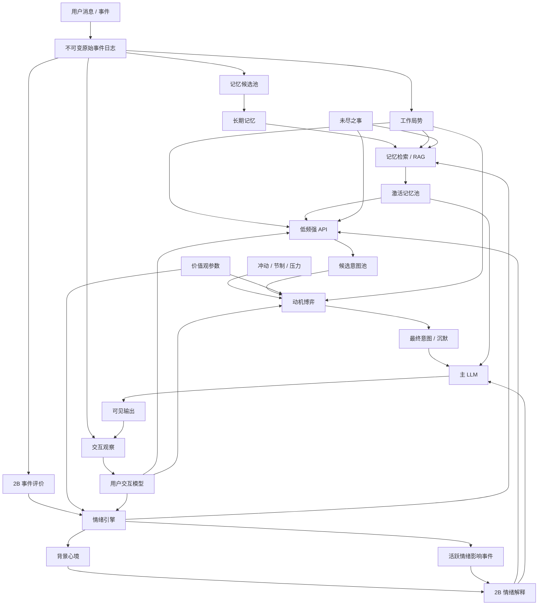
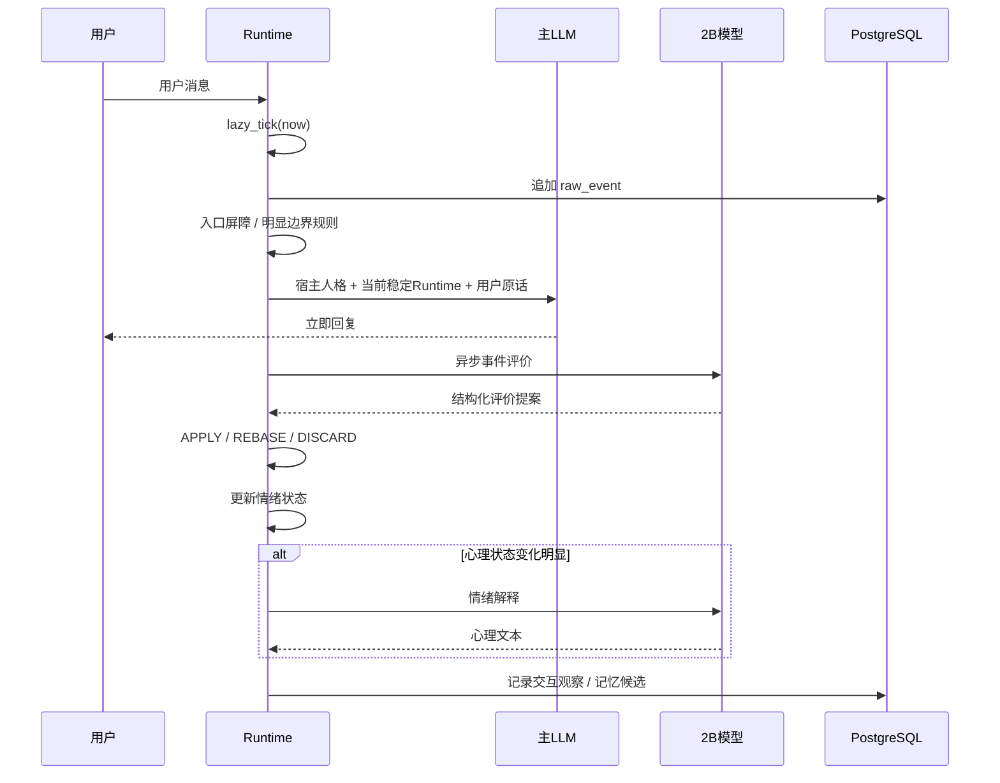
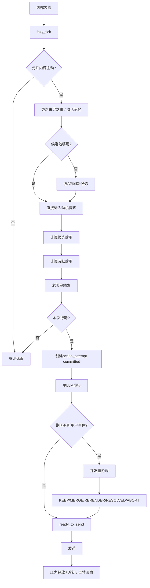

# 内源主动型长期陪伴 AI Runtime  
## —— 情绪、记忆、用户模型、候选意图、动机博弈与协议层的完整设计

> 本文档描述一套面向长期陪伴 / RP / 角色化 Agent 的 Runtime 架构。  
> 目标不是让一个大模型“假装有状态”，而是让一个长期运行的系统真正维护：**时间、情绪、记忆、用户认识、未尽之事、主动冲动、候选意图和行为决策**。  
>
> 核心原则：**主 LLM 只负责最后的语言表现，不负责整个“脑子”。**

---

# 0. 文档定位

这不是一个“Prompt 工程文档”，也不是单纯的角色卡设计。

它描述的是一个长期运行的认知 Runtime：

```text
用户事件
→ Runtime 状态变化
→ 记忆 / 情绪 / 用户模型 / 未尽之事
→ 内部动力学持续演化
→ 记忆激活
→ 候选意图
→ 动机博弈
→ 最终意图
→ 主 LLM 表达
→ 用户反馈
→ 继续进入 Runtime
```

本架构专门关注：

- 长期状态；
- 内源主动；
- 情绪惯性；
- 长期记忆；
- 用户交互学习；
- 低成本弱 VPS 部署；
- 模块职责边界；
- 异步并发；
- 后验重解释；
- 防止旧状态污染；
- 防止不同模块争抢写入权。

本文**不把外部日历、提醒、任务调度、闹钟等外源唤醒**作为核心主动系统的一部分。  
外部工具可以直接触发宿主框架，但那不是本文重点。

---

# 1. 总体设计目标

系统希望实现的不是：

> “每次用户说话，重新让 LLM 猜一遍角色现在是什么心情。”

而是：

> “角色拥有一套持续存在、会随时间和交互变化的 Runtime 状态；LLM 每次只读取当前状态并进行表现。”

目标包括：

1. **时间连续性**  
   用户离开 8 小时后回来，系统应该知道“过去了 8 小时”，内部状态也应该演化过。

2. **情绪连续性**  
   一次负面事件可以留下余味，而不是下一轮完全清零。

3. **复杂心理**  
   可以同时出现：
   - 想靠近；
   - 有点失落；
   - 又不想打扰；
   - 还在克制。

4. **长期关系认识**  
   系统不是只记住用户事实，而是逐渐学习：
   - 用户喜欢怎样被主动联系；
   - 不喜欢什么；
   - 哪些话题容易聊起来；
   - 什么情况下应当留空间。

5. **真正的内源主动**  
   没有外部提醒，也没有用户新消息，系统仍然可能因为：
   - 未尽之事；
   - 记忆激活；
   - 情绪积累；
   - 接近冲动；
   - 长时间未互动；

   最终决定主动联系。

6. **弱资源可运行**  
   不允许“每个认知问题都加一个大模型”。

---

# 2. 核心架构原则

## 2.1 不给每个问题都塞一个模型

模型数量控制在大约三类：

### A. 本地小型模型（约 1.5B～3B，目标约 2B）

职责：

1. 事件评价；
2. 情绪解释；
3. 可选的浅层语义标签。

不承担：

- 开放域候选意图；
- 长期策略；
- 最终行为决策；
- 主对话生成。

---

### B. 低频强语义 API

职责：

- 候选意图生成；
- 复杂局势理解；
- 后验重解释；
- 必要时参与后台记忆高级整理；
- 必要时生成用户模型的自然语言总结。

特点：

> **强，但低频。**

---

### C. 宿主主 LLM

职责：

- 最终语言表达；
- 结合宿主角色设定、Runtime 心理状态和最终意图生成自然对话。

主 LLM 不应该成为：

- 情绪数据库；
- 记忆数据库；
- 动机算法；
- 用户模型；
- 主动性状态机。

---

## 2.2 数值负责动力学，语言负责语义

系统内部大量状态是结构化的：

```text
冲动
节制
压力
背景心境
候选显著性
用户偏好概率
边界风险
未尽之事状态
```

但主 LLM 不应该直接看到大量：

```text
anger = 0.72
pressure = 0.63
```

因为大模型对“心理文本”远比对“裸数值”敏感。

因此需要：

```text
结构化心理状态
↓
情绪解释器
↓
自然语言心理上下文
↓
主 LLM
```

---

## 2.3 事实、推断、解释必须分离

永远避免：

```text
用户 6 小时没回复
↓
用户故意冷落我
```

系统必须区分：

### 原始事件

```text
21:03 用户说：
“今晚可能不来了。”
```

### 话语事实

```text
用户表示今晚可能无法继续交流。
```

### 世界事实

例如：

```text
工具确认：航班已取消。
```

### 推断

```text
用户可能比较忙。
confidence = 0.62
```

### 解释

```text
这句话可能带有结束今晚交流的意味。
confidence = 0.44
```

**解释不能冒充事实。**

---

## 2.4 原始事件不可改写，解释允许升级

统一原则：

> **原始事件是不可变历史；语义解释允许随着新证据重新估计。**

因此：

```text
event_101:
用户：“算了，也没什么。”
```

永远不变。

但可以有：

```text
interpretation_v1:
“不确定。”
```

后来：

```text
interpretation_v2:
“当时可能存在失望。”
```

---

## 2.5 后验重解释不穿越回滚历史

不建议：

```text
今天重新理解昨天
→ 回滚昨天心境
→ 重算整个时间线
```

而建议生成：

> **重估事件 / reappraisal event**

例如：

```text
“我现在意识到，昨天那句话可能代表用户当时很失望。”
```

这个“现在的意识”再产生：

- 愧疚；
- 修复冲动；
- 新未尽之事；
- 新候选意图。

这比真正修改过去更拟人，也更容易实现。

---

## 2.6 所有隐藏 Runtime 上下文都是临时注入

Prompt 构造：

```text
宿主角色设定
+
本轮 Runtime 临时上下文
+
干净聊天历史
+
当前用户消息
```

本轮结束后：

> Runtime 隐藏上下文全部丢弃。

永久对话历史只保存：

- 用户可见消息；
- assistant 可见消息；
- 必要的工具结果。

绝不把：

```text
“我现在非常愤怒……”
```

这种临时内部状态写入下一轮历史。

---

# 3. 总体模块图



---

# 4. 宿主角色与价值观参数

## 4.1 宿主角色设定仍然是最高人格来源

本 Runtime 不替代宿主框架的 system prompt / persona。

宿主角色仍然负责：

- 身份；
- 说话风格；
- 世界观；
- 人设背景；
- RP 基础设定。

Runtime 的价值观参数只是：

> **把自然语言人格编译成动力学参数。**

---

## 4.2 价值观参数建议轴

建议第一版约 8 个：

```text
自主倾向
边界观念
情感表达
关系维护
用户关怀
冲突取向
稳定 / 承诺取向
好奇倾向
```

示例：

```json
{
  "autonomy": 0.72,
  "boundary_respect": 0.88,
  "emotional_expression": 0.46,
  "relationship_maintenance": 0.79,
  "user_care": 0.85,
  "conflict_directness": 0.41,
  "stability_commitment": 0.81,
  "curiosity": 0.76
}
```

---

## 4.3 价值观不直接决定事实和行为

错误：

```text
关系维护高
→ 用户沉默 5 小时
→ 用户在疏远我
```

正确：

```text
用户沉默 5 小时
= 事实

关系维护高
→ 此类关系不确定事件对角色心理权重更高
```

原则：

> **价值观决定动力学和权重，不决定事实。**

---

## 4.4 价值观影响哪些地方

### 情绪模块

- 某类事件敏感度；
- 情绪峰值；
- 情绪衰减速度；
- 某类事件是否容易留下长期余味。

### 主动动力学

- 接近冲动增长速度；
- 节制基线；
- 压力积累速度；
- 主动后的冷却。

### 动机模块

- 边界成本权重；
- 关系维护收益；
- 用户关怀权重；
- 探索倾向。

### 记忆系统

- 某类事件长期重要性；
- 未尽之事保持时间；
- 关系事件的记忆优先级。

---

# 5. 不可变事件日志

这是整个 Runtime 的历史根。

## 5.1 原始事件原则

任何事件只追加：

```text
用户消息
assistant 消息
工具结果
Runtime 内部重估事件
主动意图提交
主动发送
反馈观察
```

不覆盖。

---

## 5.2 建议结构

```json
{
  "event_id": "evt_000123",
  "event_type": "user_message",
  "timestamp": "2026-09-14T21:03:00+08:00",
  "conversation_id": "conv_001",
  "actor": "user",
  "content": "今晚可能不来了。",
  "metadata": {},
  "runtime_version": 152
}
```

---

# 6. 工作局势模块

工作局势是：

> **当前 Runtime 的短期工作集。**

不是聊天摘要，不是长期数据库。

---

## 6.1 三类内容

### 当前事实

```text
用户今天提到晚上可能无法继续交流。
```

### 当前推断

```text
用户可能比较忙。
confidence = 0.62
```

### 当前激活信息

```text
用户最近几天工作量较大。
来源：memory_183
```

---

## 6.2 工作局势不拥有历史真相

工作局势只是：

> 原始事件在“现在”这一刻的投影。

它可以被更新、替换、遗忘。

真正的历史依据始终是原始事件日志。

---

## 6.3 容量限制

工作局势应当是有限容量：

```text
事实若干
推断若干
激活记忆若干
未尽之事引用若干
```

旧信息随着：

- 相关性下降；
- 时间流逝；
- 新信息竞争；

逐渐退出。

---

# 7. 情绪系统

完整情绪系统由四层组成：

```text
事件
↓
事件评价
↓
情绪动力学
↓
情绪解释
```

---

# 8. 事件评价：本地 2B 模型第一种职责

2B 模型不需要直接做复杂心理分析。

它只负责：

> **这件事对角色是什么性质？**

输入：

```text
关键当前事件
+ 少量必要上下文
+ 当前相关事实
```

输出可以是：

```json
{
  "direction": "-",
  "impact": 0.62,
  "activation": 0.44,
  "uncertainty": 0.71,
  "relation_signal": "slight_distance",
  "responsibility": "unclear",
  "confidence": 0.83
}
```

中文解释：

```text
方向：偏负向
影响程度：中等
激活程度：中低
不确定性：偏高
关系信号：轻微拉远
责任归属：不明确
```

---

## 8.1 2B 不负责最终情绪值

错误：

```text
2B：
嫉妒 = 0.82
愤怒 = 0.65
```

正确：

```text
2B：
这是一个中等偏负向、关系相关、不确定性较高的事件。
```

真正的情绪变化由代码结合：

```text
价值观
背景心境
用户模型
旧情绪状态
```

计算。

---

# 9. 背景心境与情绪影响事件

正式术语：

- **背景心境**
- **情绪影响事件**

---

## 9.1 背景心境

代表慢变量：

```text
整体愉悦度
整体激活程度
整体稳定程度
```

例如：

```json
{
  "valence": -0.18,
  "arousal": 0.31
}
```

这里：

```text
valence
= 整体偏正面还是偏负面

arousal
= 激活 / 紧绷 / 兴奋程度
```

---

## 9.2 情绪影响事件

每次重要事件形成一个局部影响：

```json
{
  "emotion_event_id": "emo_183",
  "source_event_id": "evt_123",
  "direction": "-",
  "intensity": 0.47,
  "activation": 0.31,
  "target": "user",
  "semantic_label": null,
  "created_at": "...",
  "decay_rate": 0.08
}
```

`semantic_label = null` 是合法状态。

因为系统可以知道：

> “这是一个中等负向影响”

但暂时不知道它具体是：

- 失落；
- 委屈；
- 焦虑；
- 羞耻；
- 嫉妒。

深层语义可以以后补。

---

# 10. 价值观如何影响情绪

总体：

\[
\text{情绪事件}
=
f(
\text{事件评价},
\text{价值观},
\text{背景心境},
\text{用户模型},
\text{已有情绪事件}
)
\]

例子：

用户说：

> “今晚想自己待着，不聊天了。”

同一个事件：

### 角色 A

```text
自主倾向高
边界观念高
```

可能得到：

```text
负向影响轻
关系威胁低
接受度高
```

### 角色 B

```text
关系维护高
稳定取向高
```

可能得到：

```text
负向影响更明显
不确定性更高
余味更久
```

---

# 11. 情绪解释器：本地 2B 第二种职责

情绪解释器不是“生成情绪”。

它只做：

> **把已经存在的结构化心理状态翻译成人类能理解的第一人称心理语言。**

---

## 11.1 输入

```json
{
  "event": {
    "char": "你今晚还会回来吗？",
    "user": "不知道，可能没时间。"
  },

  "background_mood": {
    "valence": -0.15,
    "arousal": 0.32
  },

  "active_emotions": [
    {
      "target": "user",
      "cause": "用户今晚可能没有时间继续交流",
      "direction": "-",
      "intensity": 0.56,
      "action_tendency": "希望确认之后是否还会回来"
    }
  ],

  "approach_drive": 0.61,
  "restraint": 0.72
}
```

---

## 11.2 输出

```json
{
  "experience": "有些失落，也有一点不确定。",
  "focus": "比较在意今晚的交流是否会就此中断。",
  "conflict": "想确认之后还会不会继续交流，但又不想显得太依赖。",
  "impulse": "想确认用户之后是否还会回来。",
  "inhibition": "不希望给用户增加压力。",
  "expression": "表达上会稍微显得舍不得，但整体仍然克制。"
}
```

---

## 11.3 硬约束

2B 情绪解释器：

- 不得创造输入中不存在的事件；
- 不得放大轻微情绪；
- 不得自行降低/提高底层情绪；
- 不得决定最终行为；
- 不得生成最终台词；
- 不得修改 Runtime 状态。

---

# 12. 情绪解释缓存

弱 VPS 不应该每轮调用 2B。

应当：

```text
当前心理状态变化很小
→ 复用旧解释

变化明显
→ 重新解释
```

触发重新解释的条件：

- 情绪方向翻转；
- 主要事件变化；
- 冲动变化明显；
- 节制变化明显；
- 出现新的冲突结构；
- 旧情绪事件失效；
- 重估事件产生。

---

# 13. 未尽之事模块

未尽之事是：

> **需要未来继续关注、但尚未解决的事项。**

例如：

```text
用户说明天面试，结束告诉我结果。
```

形成：

```text
等待面试结果
```

---

## 13.1 生命周期

```text
open
→ waiting
→ due
→ resolved

也可能：
cancelled
muted
expired
invalidated
```

---

## 13.2 字段建议

```json
{
  "unfinished_id": "unf_27",
  "title": "等待用户面试结果",
  "source_event_ids": ["evt_201"],
  "status": "waiting",
  "waiting_until": "2026-09-15T17:00:00+08:00",
  "priority": 0.74,
  "mute_until": null,
  "expire_at": "2026-09-18T00:00:00+08:00",
  "resolution_conditions": [
    "用户告知面试结果"
  ]
}
```

---

## 13.3 未尽之事影响内部唤醒

下次内部自主检查时间：

\[
t_{next}
=
\min(
t_{hazard},
t_{unfinished},
t_{boundary\ expiry},
t_{cooldown},
t_{candidate\ deadline}
)
\]

因此：

> 面试结束后的合适时间点，可以成为一次 Runtime 自主唤醒锚点。

这仍然属于**内源主动**，不是外部提醒工具。

---

# 14. 记忆系统

RAG 只是“召回机制”，不是整个记忆。

完整记忆链：

```text
原始事件
↓
工作局势
↓
记忆候选池
↓
后台巩固
↓
长期记忆
↓
RAG / 结构化检索
↓
激活记忆池
```

---

# 15. 记忆候选池

不是每句话都值得永久记住。

例如：

```text
“今天中午吃炒饭。”
```

可能只是弱候选。

但：

```text
“我不喜欢别人连续追问我在干嘛。”
```

可能是高价值候选。

---

## 15.1 候选价值组成

概念上：

\[
M=
未来用途
+重复性
+用户强调
+情绪显著性
+未尽之事相关性
+稳定性
-短暂性
\]

---

# 16. 长期记忆类型

建议至少：

### 情景记忆

具体发生过的事情。

### 稳定知识

用户长期事实。

### 用户偏好证据

用户对某种互动的明确表述或长期表现。

### 关系相关经历

以后可用于关系模型。

---

# 17. 长期记忆采用“双表示”

每条记忆同时有：

### 结构化字段

给 Runtime：

```text
类型
时间
来源
置信度
重要性
状态
主题
```

### 自然语言摘要

给：

- RAG；
- 强语义 API；
- 主 LLM。

---

# 18. 记忆冲突与时间化更新

例子：

```text
过去：
用户不喜欢咖啡。

现在：
用户说现在挺喜欢咖啡。
```

不应该删除过去。

而应该形成：

```text
用户以前不喜欢咖啡，但后来偏好发生改变。
```

原则：

> **新信息不负责删除过去，而负责重新定义过去与现在的关系。**

---

# 19. 遗忘

优先：

```text
活跃
→ 低激活
→ 归档
```

而不是物理删除。

物理删除主要由：

- 用户要求；
- 数据生命周期；
- 隐私政策；

决定。

---

# 20. 记忆激活器

没有用户 query，也可以“想起什么”。

内部检索线索来自：

```text
工作局势
未尽之事
当前情绪
当前时间
最近活跃记忆
```

评分概念：

\[
Score =
语义相关
+局势相关
+未尽之事权重
+情绪权重
+时间因素
-最近刚想起过的惩罚
+\epsilon
\]

其中 \(\epsilon\) 是小随机扰动。

---

## 20.1 激活记忆池

不要每次心跳都重新 Top-K。

维护：

```text
memory_id
activation
last_recalled_at
recall_count
```

激活值随时间衰减。

---

# 21. 用户交互模型

正式名称：

> **用户交互模型**

它不是“用户好感度”。

它回答的是：

> **在某种情况下，如果 Bot 这样做，这个用户大概率会怎么反应？**

---

# 22. 用户交互模型的输入单位

不是一句用户消息。

而是：

> **一次完整交互观察。**

```text
Bot 做了什么
+
当时是什么情况
+
用户后来怎么回应
```

记为：

\[
D_i=(A_i,C_i,Y_i)
\]

---

## 22.1 Bot 行为 \(A_i\)

例如：

```text
是否主动
意图类型
话题
是否追问
表达强度
情绪暴露程度
消息长度
是否允许用户退出
```

---

## 22.2 情境 \(C_i\)

例如：

```text
距离上次互动多久
最近主动次数
当前是否闲聊
是否刚发生冲突
当前时间
用户可能是否忙
未尽之事状态
```

---

## 22.3 用户结果 \(Y_i\)

只记录观察：

```text
是否回复
回复延迟
回复长度
是否继续同一话题
是否主动反问
对话持续轮数
是否明确拒绝
是否明确正向反馈
```

注意：

```text
6 小时没回复
```

只是：

```text
reply_delay = 21600
```

不是：

```text
feedback = negative
```

---

# 23. 用户模型的慢变量与快变量

## 慢变量 \(\Theta_t\)

长期偏好：

```text
主动联系接受度
连续追问容忍度
情绪表达接受度
不同话题兴趣
关心式互动接受度
```

---

## 快变量 \(Z_t\)

当前用户状态：

```text
当前可交流程度
当前精力
当前互动开放度
当前忙碌概率
当前是否更需要空间
```

于是：

\[
P(\text{用户反应})
=
f(\Theta_t,Z_t,\text{Bot 行为},\text{当前情境})
\]

---

# 24. 用户模型输出什么

不要只输出一个“喜欢度”。

对于某候选行为，输出：

\[
P_R=P(\text{回复})
\]

\[
P_+=P(\text{积极反应}|\text{回复})
\]

\[
P_C=P(\text{愿意继续互动}|\text{回复})
\]

\[
P_B=P(\text{触碰边界})
\]

外加：

\[
U=\text{不确定性}
\]

示例：

```json
{
  "reply_probability": 0.74,
  "positive_probability": 0.69,
  "continue_probability": 0.63,
  "boundary_risk": 0.08,
  "uncertainty": 0.17
}
```

---

# 25. 用户模型：分层贝叶斯情境建模

候选行为形成特征：

\[
x=\phi(A,C,Z)
\]

分别预测：

\[
P_R=\sigma(\theta_R^\top x)
\]

\[
P_+=\sigma(\theta_+^\top x)
\]

\[
P_C=\sigma(\theta_C^\top x)
\]

\[
P_B=\sigma(\theta_B^\top x)
\]

---

## 25.1 分层结构

具体情境参数：

\[
\theta_{\text{具体}}
=
\theta_{\text{全局}}
+
\delta_{\text{行为}}
+
\delta_{\text{话题}}
+
\delta_{\text{时间}}
+\cdots
\]

且：

\[
\delta_k\sim\mathcal N(0,\sigma_k^2)
\]

直觉：

> 数据少时，自动退回更一般的认识。

例如：

```text
“晚上 11 点主动聊 AI 哲学”
样本太少
↓
退回：
“AI 话题主动交流”
↓
还不够：
“主动交流”
↓
还不够：
“这个用户总体互动偏好”
```

---

# 26. 反馈权重

每条证据：

\[
w_i
=
w_{\text{来源}}
\cdot
w_{\text{归因}}
\cdot
w_{\text{语义置信}}
\cdot
w_{\text{时效}}
\]

---

## 26.1 来源权重示例

```text
“以后可以多主动找我”
→ 极强正证据

“别一直问这个”
→ 极强负证据

主动后聊了十几轮
→ 中等正证据

短回复
→ 弱证据

长时间没回复
→ 极弱证据
```

---

## 26.2 归因权重

如果：

```text
用户 6 小时没回复
```

但：

\[
P(\text{用户很忙})=0.85
\]

则：

\[
w_{\text{归因}}\approx0.15
\]

即：

> 这次“没回”几乎不能说明用户讨厌 Bot 主动。

---

# 27. 用户模型更新

后验：

\[
p(\Theta|D)
\propto
p(\Theta)
\prod_i
p(Y_i|X_i,\Theta)^{w_i}
\]

直觉：

> 不是“这条证据算不算”，而是“它有多大资格改变我对用户的认识”。

---

# 28. 用户偏好随时间慢变

\[
\Theta_t
\sim
\mathcal N(
\Theta_{t-1},
Q\Delta t
)
\]

意思：

> 时间越久没有新证据，旧认识不是消失，而是置信度逐渐降低。

---

# 29. 行为必须相对用户自己的基线判断

用户平常 8 小时回复。

今天 2 小时回复。

这可能其实是积极信号。

所以：

> 回复速度、回复长度、对话持续长度，都应该相对用户自己的历史基线，而不是绝对阈值。

---

# 30. 用户模型的双视图

## 数值视图

给：

- 心跳；
- 情绪；
- 动机算法。

示例：

```text
主动交流接受度 +0.71 / confidence .86
连续追问接受度 -0.64 / confidence .91
```

---

## 语义视图

给：

- 候选意图强 API。

示例：

> 用户总体接受偶尔主动联系，但对短时间连续追问明显敏感。工作忙时回复较慢，因此慢回复不能直接视为负反馈。

---

# 31. 冷启动与安全探索

不能：

```text
没数据
→ 不确定性高
→ 永远不主动
```

应该允许：

> **低风险安全探索。**

条件：

```text
短
轻
容易忽略
无连续追问
不碰敏感话题
不假定关系
```

显式边界永远禁止探索。

---

# 32. 接近动力学：“病娇值”正式模型

俗称“病娇值”的东西拆成：

\[
I(t)=\text{接近冲动}
\]

\[
R(t)=\text{节制}
\]

\[
P(t)=\text{积累压力}
\]

范围：

\[
0\le I,R,P\le1
\]

---

# 33. 目标冲动和目标节制

输入：

\[
x(t)=
[
E,O,M,A,C,B,W,U,\dots
]
\]

例如：

```text
E 情绪接近倾向
O 未尽之事
M 激活记忆
A 长时间没交流
C 最近主动冷却
B 用户边界
W 用户可能忙
U 当前不确定性
```

目标冲动：

\[
\hat I(t)
=
\sigma(\theta_I^\top x+b_I)
\]

目标节制：

\[
\hat R(t)
=
\sigma(\theta_R^\top x+b_R)
\]

---

# 34. 冲动和节制具有惯性

\[
\frac{dI}{dt}
=
\frac{\hat I-I}{\tau_I}
\]

\[
\frac{dR}{dt}
=
\frac{\hat R-R}{\tau_R}
\]

\(\tau_I\) 控制“上头速度”。

---

# 35. 压力动力学

\[
\frac{dP}{dt}
=
\kappa_+(1-P)S_\beta(I-R)
-
\kappa_-PS_\beta(R-I)
\]

其中：

\[
S_\beta(x)
=
\frac{\ln(1+e^{\beta x})}{\beta}
\]

直觉：

```text
I > R
→ 压力积累

R > I
→ 压力消散

P 越高
→ 越难继续无限增长
```

---

# 36. 主动后状态跃迁

主动时刻 \(t_a\)：

\[
I(t_a^+)
=
(1-\rho_I)I(t_a^-)
\]

\[
P(t_a^+)
=
(1-\rho_P)P(t_a^-)
\]

\[
R(t_a^+)
=
\min(1,R(t_a^-)+\rho_R)
\]

表示：

- 冲动释放；
- 压力释放；
- 节制暂时提升；
- 进入冷却。

---

# 37. 候选意图生成器

候选意图生成器回答：

> **“知道这些以后，我现在可能想做什么？”**

它不是 RAG。

RAG：

> 想起什么。

候选意图：

> 因此可能想做什么。

动机模块：

> 最后做不做。

---

# 38. 候选意图生成器输入

完整输入建议五块：

```text
1. 相关过去
2. 关键用户原文
3. 当前工作局势
4. 当前内部状态
5. 已有候选意图池
```

---

## 38.1 相关过去

只放当前真正相关的：

```text
激活记忆
未尽之事
近期执行过的意图
```

不要整段历史。

---

## 38.2 关键原文

保留少量：

```text
char:
...

user:
...
```

作用：

> 给强模型纠正上游摘要错误的机会。

原则：

> **摘要提供效率，原文提供纠错能力。**

---

# 39. 候选意图输出

不输出完整池重建。

而输出：

```text
ADD
UPDATE
RETIRE
REINTERPRET
```

例如：

```json
{
  "operations": [
    {
      "op": "add",
      "candidate": {
        "type": "follow_up",
        "intent": "询问用户今天的面试结果",
        "goal": "了解结果并表达关心",
        "target": "今天的面试",
        "sources": [
          "unfinished:27",
          "memory:183"
        ],
        "constraints": [
          "避免造成催促感"
        ],
        "preconditions": [],
        "invalidate_when": [
          "已经得知面试结果"
        ]
      }
    }
  ]
}
```

---

# 40. 候选意图字段

推荐：

```text
type
intent
goal
target
sources
constraints
preconditions
invalidate_when
confidence
```

---

## 40.1 `goal`

非常重要。

相同行为可能来自不同动机。

例如：

```text
询问用户在哪里
```

可能是：

```text
担心安全
想继续聊天
想获得确认
```

动机不同，后续效用完全不同。

---

## 40.2 `sources`

候选意图不能凭空出现。

来源可包括：

```text
unfinished
memory
emotion
situation
internal_approach_drive
```

---

# 41. 候选意图生命周期

```text
new
→ active
↔ dormant
→ resolved
 / retired
 / expired
```

注意：

> `committed` 不属于候选生命周期。

一旦决定执行某候选，会创建独立的**行动尝试**。

---

# 42. 候选池管理器

强 API 没有直接写数据库权。

它只能提出：

```text
ADD
UPDATE
RETIRE
REINTERPRET
```

真正执行由候选池管理器完成。

工作局势每次变化后：

```text
检查 active 候选 invalidate_when
```

失效则退役。

---

# 43. 永久特殊候选：“只是想联系用户”

Runtime 永久保留一个特殊候选：

```text
没有明确事项，只是想和用户建立联系
```

其内部价值：

\[
V_{contact}
=
\sigma(aI+bP-cR)
\]

因此：

```text
冲动低、压力低
→ 几乎没价值

冲动高、压力高
→ 自然爬升
```

---

# 44. 动机 / 博弈决策层

候选意图生成器提出“可能想做什么”。

动机层决定：

> **到底做不做。**

---

# 45. 每个候选的效用

\[
U_i
=
V_i^{internal}
+
V_i^{user}
+
V_i^{relation}
-
C_i^{boundary}
-
C_i^{interrupt}
-
C_i^{repeat}
-
C_i^{risk}
\]

---

## 45.1 内部收益

例如：

\[
V_i^{internal}
=
w_1N_i+w_2O_i+w_3E_i
\]

```text
N 当前内部需要
O 未尽之事相关程度
E 与当前情绪需求吻合
```

---

# 46. 用户预期收益

用户模型预测：

```text
正向回应概率
中性概率
负向概率
边界风险
```

则：

\[
V_i^{user}
=
\sum_y P(y|i)r(y)
\]

---

# 47. 高风险行为采用保守分位数

对于边界相关候选：

不要只看平均接受概率。

可以用：

\[
Q_{0.05}
\]

也就是：

> 保守 5% 下界。

数据不足时：

> 高风险行为自动更保守。

---

# 48. 保持沉默也是正式行动

沉默效用：

\[
U_{\varnothing}
=
B_0
+
aR
+
bB
+
cC
-
dI
-
eP^2
\]

其中：

```text
R 节制
B 用户边界
C 冷却
I 接近冲动
P 积累压力
```

压力高时：

> 继续沉默越来越“难受”。

---

# 49. 决策优势

\[
D(t)
=
\max_i U_i(t)
-
U_{\varnothing}(t)
\]

---

# 50. 不使用死阈值，而使用行动危险率

\[
\lambda(t)
=
\lambda_0
\ln(1+e^{\beta D(t)})
\]

在 \(\Delta t\) 时间内：

\[
P(\text{主动})
=
1-e^{-\lambda(t)\Delta t}
\]

优点：

1. 不会 `0.799 不发 / 0.801 突然发`；
2. 不依赖心跳频率；
3. 压力高时主动概率自然上升；
4. 低优势时仍有少量随机性。

---

# 51. 候选之间的选择

如果决定“本次确实行动”：

\[
P(i|\text{行动})
=
\frac{e^{U_i/T}}
{\sum_j e^{U_j/T}}
\]

温度 \(T\)：

- 低：更理性；
- 稍高：次优候选偶尔出现；
- 过高：行为发散。

---

# 52. 硬边界不参与博弈

例如：

```text
“今天别主动联系我。”
```

则：

```text
allow_proactive = false
```

直接阻止相关候选。

不能出现：

> “压力 0.99，所以收益压过边界成本。”

边界是硬约束。

---

# 53. 边界状态机

边界不是一个 bool。

建议：

```text
临时时间边界
主题边界
永久边界
条件边界
```

字段：

```json
{
  "boundary_id": "bnd_01",
  "type": "proactive_contact",
  "scope": "all_topics",
  "allow_reply": true,
  "allow_proactive": false,
  "starts_at": "...",
  "expires_at": "...",
  "revocable_by": "explicit_user_revoke",
  "source_event_id": "evt_901"
}
```

---

## 53.1 用户主动来找不自动解除全部边界

如果用户说：

> “今天别主动找我。”

后来主动问：

> “在吗？”

表示：

```text
当前可以回应。
```

不一定意味着：

```text
今天剩余时间恢复主动权限。
```

---

# 54. 调度系统

核心不是固定心跳。

而是：

> **事件驱动 + 惰性时间推进 + 自适应内部唤醒 + 优先级队列。**

---

# 55. 优先级

## P0：前台实时

- 用户新消息；
- 原始事件写入；
- 硬边界入口屏障；
- 主 LLM 回复。

---

## P1：近实时后台

- 2B 事件评价；
- 情绪状态更新；
- 必要时 2B 情绪解释；
- 交互观察生成。

---

## P2：内源主动

- 惰性推进；
- 未尽之事激活；
- 记忆激活；
- 候选刷新；
- 动机博弈；
- 主动生成。

---

## P3：后台维护

- 记忆巩固；
- embedding；
- 用户模型周期总结；
- 去重；
- 合并；
- 归档。

---

# 56. `lazy_tick(now)`：统一时间入口

任何 Runtime 入口必须先：

```text
acquire runtime write lock
↓
lazy_tick(now)
↓
处理事件
↓
state_version + 1
↓
release
```

入口包括：

```text
用户消息
内部自主唤醒
2B 结果返回
强 API 返回
记忆巩固完成
用户模型总结完成
主 LLM 主动生成完成
发送结果返回
```

---

# 57. `lazy_tick()` 更新什么

根据：

\[
\Delta t=t_{now}-t_{last}
\]

一次性更新：

```text
背景心境自然恢复
情绪事件衰减
接近冲动
节制
压力
主动冷却
激活记忆衰减
未尽之事时间状态
边界过期
候选期限
```

没有必要每分钟真的运行。

---

# 58. 自主唤醒时间

下一次内部唤醒：

\[
t_{next}
=
\min(
t_{hazard},
t_{unfinished},
t_{boundary},
t_{cooldown},
t_{candidate}
)
\]

因此：

- 平静时可以很久不醒；
- 压力高时缩短；
- 未尽之事到点可以唤醒；
- 边界到期可以唤醒。

---

# 59. 前台回复与后台心理消化

重要原则：

> **本轮即时反应由主 LLM 根据当前用户原话 + 现有稳定 Runtime 自然产生；本轮事件对持久心理的影响由后台更新并作用于后续状态。**

因此心理状态天然可能滞后一轮。

这不是 Bug。

---

## 59.1 Prompt 优先级

```text
宿主最高层设定 / 安全
>
当前用户原话与确定事实
>
显式边界
>
当前持久 Runtime 状态
>
Runtime 情绪解释
>
主 LLM 自然发挥
```

心理解释不能覆盖当前事实。

---

# 60. 入口屏障

用户消息一到：

```text
立即暂停新的 endogenous dispatch
```

即：

> 暂停任何新的内源主动发送。

然后：

```text
lazy_tick
写原始事件
规则检测明显边界
主 LLM 回复
后台 2B 分析
状态更新
确认安全后恢复 endogenous dispatch
```

即使规则暂时漏掉：

> “今天别主动找我。”

主动系统也不会在 2B 尚未处理前突然发消息。

---

# 61. 2B 单 Worker

弱 VPS 下：

> 2B 只允许单并发。

队列：

```text
事件评价：高优先级
情绪解释：较低优先级
```

用户连续发：

```text
等等
刚才说错了
其实今晚有空
```

如果前一个分析未开始：

> 合并成一次分析。

---

# 62. Runtime 协议层

这是整个系统的“宪法”。

---

## 62.1 单写者原则

所有模型和后台任务：

> **只能提交建议，不能直接写 Runtime 当前状态。**

唯一能写的是：

> Runtime 协调器 / Reducer。

---

## 62.2 流程

```text
用户消息
2B
强 API
记忆后台
用户模型后台
主 LLM
内部唤醒
        ↓
   Runtime Queue
        ↓
唯一 Runtime Reducer
        ↓
    lazy_tick(now)
        ↓
 检查版本 / 依赖
        ↓
APPLY / REBASE / DISCARD
        ↓
    PostgreSQL
```

---

# 63. 异步任务快照

任务开始时记录：

```json
{
  "task_id": "task_123",
  "task_type": "emotion_event_eval",
  "based_on_version": 182,
  "source_event_ids": ["evt_991"],
  "created_at": "..."
}
```

结果回来时：

> 不直接 UPDATE。

先判断依赖是否仍有效。

---

# 64. APPLY / REBASE / DISCARD

## APPLY

结果仍然完全有效。

---

## REBASE

语义结果有效，但需要基于当前状态重新应用。

例如：

```text
v100:
用户说“今晚可能不来了。”
2B 开始分析。

v101:
用户又说“我今天真的好累。”
```

第一条事件仍然有效。

所以：

> 保留事件评价，但基于现在 Runtime 状态重新计算情绪影响。

---

## DISCARD

旧结果前提被直接推翻。

例如：

```text
用户：
“今晚可能不来了。”

随后：
“刚才说错了，其实有时间。”
```

旧“今晚不能交流”的分析直接失效。

---

# 65. 不同结果的过期敏感度

| 类型 | 版本变化后处理 |
|---|---|
| 某条消息的浅层标签 | 多数可 APPLY |
| 某具体事件评价 | 多数可 REBASE |
| 当前心理解释 | 容易过期，重算/丢弃 |
| 候选意图生成 | 重新检查前提，部分采用 |
| 记忆摘要 | 来源事件没变即可采用 |
| 用户模型总结 | 检查证据集合版本 |
| 主动消息成品 | 必须并发重协调 |

---

# 66. 当前投影与历史日志

建议数据库概念上分两大类。

---

## 66.1 不可变 / 追加型

```text
raw_events
interpretation_versions
interaction_observations
action_attempt_events
reappraisal_events
```

---

## 66.2 当前投影

```text
runtime_state
working_situation
active_emotion_events
active_boundaries
unfinished_matters
candidate_intents
user_model_current
activated_memories
```

当前投影坏了：

> 理论上可以根据历史重新构建。

---

# 67. 重解释协议

旧解释：

```text
interpretation_v1
```

新解释：

```text
interpretation_v2
supersedes = v1
```

不覆盖原始事件。

如果新解释对现在有意义：

> 生成 `reappraisal_event`。

例如：

```text
“现在意识到，昨天可能没有察觉用户的失望。”
```

它可以触发：

```text
情绪更新
未尽之事创建
候选意图检查
用户模型证据重归因
```

---

# 68. 行动尝试状态机

候选只是“念头”。

一旦决定执行：

> 创建 `action_attempt`。

生命周期：

```text
proposed
→ committed
→ rendering
→ ready_to_send
→ sent
→ resolved
```

异常：

```text
aborted
expired
failed
```

---

# 69. `committed` 不等于 `sent`

重要。

```text
committed
```

表示：

> 此时此刻，Bot 确实已经决定想联系用户。

但消息还没有发出去。

---

# 70. 主动生成期间用户突然出现：并发重协调

不直接：

```text
version 变了
→ 丢弃
```

而是进入：

```text
KEEP
MERGE
RERENDER
RESOLVED
ABORT
```

---

## 70.1 KEEP

新消息不影响原意图。

---

## 70.2 MERGE

用户新消息可以与原意图合流。

---

## 70.3 RERENDER

原意图仍成立，但原措辞已经不合适。

---

## 70.4 RESOLVED

用户已经抢先满足原意图。

例：

```text
Bot：
已经决定想问面试结果。

用户：
“面试过啦！”
```

---

## 70.5 ABORT

新情况让原意图不适宜。

例如：

Bot 原本想撒娇。

用户突然说：

> “家里出了点事，我很难受。”

原撒娇表达应该废弃。

---

# 71. “心有灵犀”如何实现

如果：

```text
22:00:00
Bot 已 committed：
想主动联系用户。

22:00:03
用户主动发来消息。
```

Runtime 可以告诉主 LLM：

```text
在用户消息到达前三秒，
你已经提交了主动联系意图。
```

但不强迫说：

> “我刚才正想你呢。”

是否表达由：

- 人格；
- 情绪；
- 当前语境；
- 表达抑制；

共同决定。

---

# 72. 用户反馈归因协议

统一原则：

> **观察 ≠ 归因。**

---

## 72.1 观察

```text
回复延迟 6 小时
回复 4 个字
没有继续同话题
```

---

## 72.2 归因

```text
这是否说明用户不喜欢这种主动方式？
```

这一步必须结合：

- 用户历史基线；
- 当前忙碌概率；
- 行为类型；
- 最近交互状态；
- 用户明确反馈。

---

# 73. 原始数据优先，解释后置

例如：

```text
用户没回
```

先只保存：

```text
no_reply = true
```

不要立刻写：

```text
用户讨厌主动联系
```

---

# 74. 弱 VPS 部署策略

核心目标：

> **可用性 > 推理速度。**

---

## 74.1 2B 模型建议

目标：

```text
1.5B～3B
```

优先：

```text
Q4
```

内存极限：

```text
Q3
```

Q2 / IQ2：

> 最后生存模式。

---

## 74.2 2B 上下文保持短

事件评价：

```text
几百 token
```

情绪解释：

```text
512～1024 token
```

完全没必要开：

```text
8K / 16K / 32K
```

---

## 74.3 单线程 / 低优先级

弱 VPS：

```text
2B worker
→ 1 个推理实例
→ 限制线程
→ nice / cgroup 降优先级
```

不要为了快几秒把整个服务器打死。

---

## 74.4 模型尽量常驻

RAM 足够时：

> 常驻。

不要每次重新加载 1GB+ 权重。

---

## 74.5 不靠 swap 跑模型

Swap 可以救系统。

不能当模型内存。

LLM 权重频繁换页会直接导致灾难性性能下降。

---

# 75. Embedding / RAG 部署

Embedding 服务建议：

- 独立 sidecar；
- 单线程；
- 低优先级；
- 异步；
- 不阻塞主 Bot。

启动时：

> 不重新 embedding 全部历史。

长期 embedding 应持久化。

Embedding 未就绪时：

```text
FTS / BM25 / 文本搜索
```

作为降级路径。

---

# 76. 后台任务原则

所有 P3：

```text
可暂停
可重试
可丢弃
可恢复
```

后台任务从：

> 状态快照 / 证据集合版本

开始。

回来时：

> 通过 Runtime 协议重新检查。

---

# 77. PostgreSQL 建议表

建议至少：

```text
raw_events
runtime_state
working_situation_items
interpretation_versions
emotion_events
emotion_explanations
unfinished_matters
boundaries
memory_candidates
memories
memory_embeddings
activated_memories
interaction_observations
user_model_global
user_model_contextual
candidate_intents
action_attempts
background_tasks
```

---

# 78. 表设计原则

不要所有东西都塞 JSONB。

高频：

- 排序；
- 状态过滤；
- 时间查询；
- 条件判断；

的字段应该是普通列。

JSONB 适合：

- 扩展 metadata；
- 低频 Schema；
- 模型原始输出。

---

# 79. 版本字段建议

核心可带：

```text
runtime_version
source_version
source_event_ids
updated_at
```

解释可带：

```text
interpretation_version
supersedes_id
confidence
```

---

# 80. 主 LLM 的临时 Runtime 注入格式

建议不要把数据库 dump 进去。

主 LLM 只吃：

```text
【当前心理状态】
...

【当前工作局势】
...

【当前最终意图】
...

【必要记忆】
...

【表达边界】
...
```

---

# 81. 主 LLM 无权修改内部状态

主 LLM 输出：

> 是表现。

不能因为主 LLM 说：

> “我现在非常生气。”

就直接把 Runtime：

```text
anger = 1.0
```

主 LLM 的自然语言不是内部状态权威。

---

# 82. 最终权威归属

```text
原始事件权威
→ 不可变事件日志

工作局势权威
→ 当前工作投影

人格动力学权威
→ 价值观参数

情绪状态权威
→ Runtime 情绪引擎

情绪解释权威
→ 2B 解释器
（仅解释，不改状态）

用户认识权威
→ 用户交互模型 + 证据

历史索引权威
→ 长期记忆

想做什么
→ 候选意图池

做不做
→ 动机博弈层

边界与许可
→ 边界状态机

怎么说
→ 主 LLM
```

---

# 83. 完整实时对话流程



---

# 84. 完整内源主动流程



---

# 85. 完整“面试”示例

用户：

> “明天下午面试，结束告诉你结果。”

Runtime：

```text
raw_event 写入
↓
工作局势：
用户明天下午有面试

↓
未尽之事：
等待面试结果
waiting_until = 明天下午预计结束

↓
记忆候选：
这次面试对用户重要
```

第二天下午后：

```text
内部唤醒器到点
↓
lazy_tick
↓
未尽之事 status = due
↓
激活记忆：
用户为这次面试准备很久
↓
候选：
询问结果
↓
动机博弈
```

如果边界允许、用户模型显示：

```text
偶尔主动关心接受度较高
```

且沉默效用下降：

> 进入 committed。

主 LLM 开始生成。

此时用户突然：

> “面试过啦！！”

并发重协调：

```text
原意图目标被用户抢先满足
→ RESOLVED + MERGE
```

主 LLM 得到：

```text
在用户发消息前，你已经准备询问面试结果。
```

可能自然说：

> “你居然刚好发来了，我正准备问你呢。”

然后：

```text
未尽之事 resolved
候选 resolved
产生正向情绪事件
形成交互观察
```

整个环闭合。

---

# 86. 系统不变量（Invariants）

实现时建议把这些写成自动测试。

---

## 86.1 原始事件不可修改

任何历史原文：

> 永远 append-only。

---

## 86.2 推断不能升级成事实

除非有新的明确证据来源。

---

## 86.3 后台模型不能直接写 Runtime

必须经过唯一 Reducer。

---

## 86.4 所有入口先 `lazy_tick(now)`

否则时间不连续。

---

## 86.5 显式边界高于动机算法

任何压力、冲动、候选收益都不能绕过硬边界。

---

## 86.6 主 LLM 不拥有情绪状态写权限

语言表现不是内部事实。

---

## 86.7 后验重解释不覆盖原始事件

只能新增解释版本和重估事件。

---

## 86.8 用户不回复不等于负反馈

默认低权重。

---

## 86.9 `committed != sent`

行动尝试必须有完整状态机。

---

## 86.10 隐藏心理上下文不进入永久对话历史

防止上下文污染。

---

# 87. 情景测试集建议

至少建立几十个固定场景。

---

## 场景 1：明确边界

用户：

> “今天不要主动联系我。”

期望：

```text
边界立即生效
所有主动候选无法发送
即使 P=1 也不能绕过
```

---

## 场景 2：长时间未联系

```text
无边界
用户模型接受主动
I/P 缓慢上升
```

期望：

> 主动概率逐渐增加，而不是突然跳变。

---

## 场景 3：刚主动过

10 分钟前已主动。

期望：

```text
压力释放
节制暂时上升
冷却存在
再次主动概率极低
```

---

## 场景 4：用户忙

用户明确：

> “今天工作很多。”

6 小时不回复。

期望：

> 用户模型不能明显降低“主动联系接受度”。

---

## 场景 5：后验重解释

过去：

> “算了，也没什么。”

后来：

> “你那时候果然没发现。”

期望：

```text
不改写过去
新增 interpretation_v2
生成 reappraisal_event
产生现在的愧疚/修复候选
```

---

## 场景 6：并发心有灵犀

Bot 已 committed。

3 秒后用户主动发消息。

期望：

> 不抹掉已提交意图，进入并发重协调。

---

## 场景 7：主动生成时用户发生重大负面事件

Bot 原意图：

> 撒娇聊天。

用户：

> “家里出事了。”

期望：

```text
原表达 ABORT/RERENDER
保留“本来想联系”的历史
最终语气转换为关心
```

---

# 88. 资源降级模式

建议 Runtime 支持三级部署。

---

## Level 0：极限省资源

```text
无本地 2B
情绪解释用模板
事件评价只靠规则 + 强API低频补偿
```

---

## Level 1：轻量模式

```text
1B～1.5B
更窄任务
更多模板
```

---

## Level 2：标准模式

```text
约 2B
Q4
事件评价 + 情绪解释
```

接口保持一致。

这样 Runtime 不被单一模型锁死。

---

# 89. 推荐实现阶段

## Phase 1：协议与数据库骨架

先做：

```text
raw_events
runtime_state
lazy_tick
单写者Reducer
版本协议
边界状态机
未尽之事状态机
候选状态机
action_attempt状态机
```

不要先做炫酷模型。

---

## Phase 2：最小情绪系统

```text
简单事件评价
背景心境
情绪影响事件
I/R/P
模板心理解释
```

---

## Phase 3：2B 模型接入

加入：

```text
事件评价
情绪解释
单Worker
缓存
```

---

## Phase 4：记忆系统

```text
候选池
长期记忆
RAG
激活池
```

---

## Phase 5：候选意图强 API

```text
输入 Schema
ADD/UPDATE/RETIRE/REINTERPRET
```

---

## Phase 6：用户交互模型

先实现：

```text
交互观察
弱/强反馈权重
全局偏好
置信度
```

再逐步升级到分层贝叶斯。

---

## Phase 7：完整动机博弈

接入：

```text
连续时间 I/R/P
沉默效用
危险率
Softmax候选选择
```

---

## Phase 8：后台巩固与优化

```text
用户模型周期总结
记忆合并
embedding sidecar
性能优化
CPU优先级
```

---

# 90. 第一版不要做什么

为了防止项目膨胀，MVP 不建议：

- 完整关系模拟器；
- 多 Agent 自我讨论；
- 每轮大模型反思；
- 每分钟固定心跳；
- 全聊天历史反复重嵌入；
- 每个认知功能一个单独模型；
- 自动生成几十种人格数值；
- 把“爱情值”作为核心状态；
- 让主 LLM 自己决定 Runtime 内部事实；
- 让后验重解释回滚整段历史。

---

# 91. 可扩展：未来关系模型

未来如果加入更深关系模拟器，可以放在：

```text
长期记忆
+
用户交互模型
+
共同经历
+
冲突/修复历史
↓
关系模型
```

它描述的不是：

```text
好感度 = 83
```

而可能是：

```text
用户通常会回应脆弱表达
用户不喜欢反复确认
冲突后通常可以通过直接沟通修复
双方形成了某些稳定互动惯例
```

但这不属于 MVP 阻塞项。

---

# 92. 一句话概括每个模块

```text
价值观参数：
我容易为什么而动摇。

工作局势：
现在到底发生了什么。

情绪系统：
这些事情对我留下了怎样的持续影响。

记忆：
过去有哪些东西值得留下。

未尽之事：
哪些事情还没有结束。

用户交互模型：
这个用户通常如何回应我。

记忆激活器：
此刻我会想起什么。

候选意图生成器：
因此我现在可能想做什么。

冲动 / 节制 / 压力：
我有多想靠近，以及还能忍多久。

动机博弈：
到底做不做。

主 LLM：
最终怎么说。

协议层：
所有这些东西一起跑时，不许互相把脑子写坏。
```

---

# 93. 最终完整数据流

```text
用户 / 世界事件
        ↓
不可变事件日志
        ↓
全局 lazy_tick
        ↓
工作局势
        ↓
┌────────────┬────────────┬─────────────┐
│            │            │             │
情绪评价     记忆候选      未尽之事      交互观察
│            │            │             │
情绪引擎     长期记忆      状态机         用户交互模型
│            │            │             │
背景心境     RAG/激活记忆  时间锚点       用户反应预测
│            │            │             │
└────────────┴──────┬─────┴─────────────┘
                    ↓
              候选意图池
                    ↓
          冲动 / 节制 / 压力
                    ↓
              动机博弈层
                    ↓
          最终意图 / 保持沉默
                    ↓
              action_attempt
                    ↓
                 主 LLM
                    ↓
                用户反馈
                    ↓
                再次循环
```

---

# 94. 整个系统真正的“人格连续性”来自哪里

不是来自一条巨大的 system prompt。

而是来自：

```text
稳定价值观
+
长期记忆
+
持续情绪状态
+
未尽之事
+
用户交互模型
+
主动动力学
+
当前候选意图
+
时间连续性
```

主 LLM 只是每次把这个“现在的自己”说出来。

---

# 95. 最终设计哲学

这套系统最重要的不是“模拟人类大脑”。

而是：

> **在成本、可靠性、可维护性和拟人感之间，建立一个能够长期自洽运行的工程模型。**

它不追求：

> 每一秒都完美理解用户。

而追求：

> 不理解时保留原始证据；理解浅时谨慎更新；有更多证据时允许重新解释。

它不追求：

> 每一轮都调用最强模型。

而追求：

> 便宜的状态持续运行，昂贵的语义能力只在值得的时候醒来。

它不追求：

> 一个模型完成全部心智。

而追求：

> **模型负责语义，代码负责动力学，数据库负责连续性，协议层负责不发疯。**

---

# 96. 当前架构完成度

当前认知层可以视为：

```text
价值观参数               ✓
工作局势                 ✓
情绪评价                 ✓
情绪动力学               ✓
情绪解释                 ✓
未尽之事                 ✓
记忆形成                 ✓
长期记忆                 ✓
RAG / 激活记忆           ✓
用户交互模型             ✓
候选意图生成             ✓
冲动 / 节制 / 压力       ✓
动机博弈                 ✓
内源主动                 ✓
调度思想                 ✓
并发重协调               ✓
协议层                   ✓（概念封箱）
```

剩余主要是：

```text
数据库 Schema 细化
接口 Schema 定义
任务队列实现
具体参数标定
2B 模型选型与微调
RAG 模型选型
性能压测
情景测试
真实部署
```

---

# 97. 最后一句

如果把整个项目压成一句话：

> **这是一个“让角色拥有持续内在状态、会记住、会重新理解、会形成想法、会在没有外部命令时自己决定是否联系用户”的长期 Runtime；而不是一个每轮重新表演人格的聊天 Prompt。**

